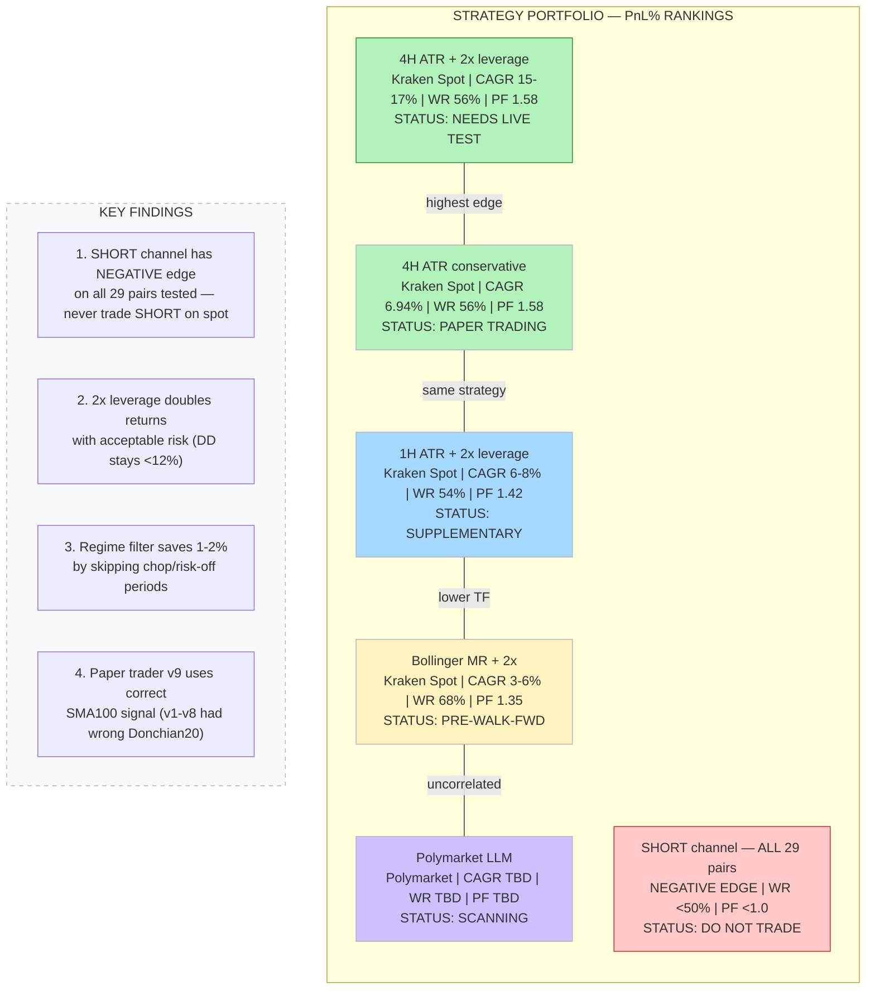

# Strategy Portfolio — PnL% Rankings

```mermaid
graph TB
    subgraph STRATS["STRATEGY PORTFOLIO — PnL% RANKINGS"]
        direction TB

        S1["4H ATR + 2x leverage\nKraken Spot | CAGR 15-17% | WR 56% | PF 1.58\nSTATUS: NEEDS LIVE TEST"]
        S2["4H ATR conservative\nKraken Spot | CAGR 6.94% | WR 56% | PF 1.58\nSTATUS: PAPER TRADING"]
        S3["1H ATR + 2x leverage\nKraken Spot | CAGR 6-8% | WR 54% | PF 1.42\nSTATUS: SUPPLEMENTARY"]
        S4["Bollinger MR + 2x\nKraken Spot | CAGR 3-6% | WR 68% | PF 1.35\nSTATUS: PRE-WALK-FWD"]
        S5["Polymarket LLM\nPolymarket | CAGR TBD | WR TBD | PF TBD\nSTATUS: SCANNING"]
        SK["SHORT channel — ALL 29 pairs\nNEGATIVE EDGE | WR <50% | PF <1.0\nSTATUS: DO NOT TRADE"]
    end

    S1 ---|"highest edge"| S2
    S2 ---|"same strategy"| S3
    S3 ---|"lower TF"| S4
    S4 ---|"uncorrelated"| S5

    subgraph FINDINGS["KEY FINDINGS"]
        K1["1. SHORT channel has NEGATIVE edge\non all 29 pairs tested — never trade SHORT on spot"]
        K2["2. 2x leverage doubles returns\nwith acceptable risk (DD stays <12%)"]
        K3["3. Regime filter saves 1-2%\nby skipping chop/risk-off periods"]
        K4["4. Paper trader v9 uses correct\nSMA100 signal (v1-v8 had wrong Donchian20)"]
    end

    style SK fill:#ffc9c9,stroke:#c92a2a
    style S1 fill:#b2f2bb,stroke:#2b8a3e
    style S2 fill:#b2f2bb,stroke:#adb5bd
    style S3 fill:#a5d8ff,stroke:#adb5bd
    style S4 fill:#fff3bf,stroke:#adb5bd
    style S5 fill:#d0bfff,stroke:#adb5bd
    style FINDINGS fill:#f8f9fa,stroke:#adb5bd,stroke-dasharray: 5 5

```
