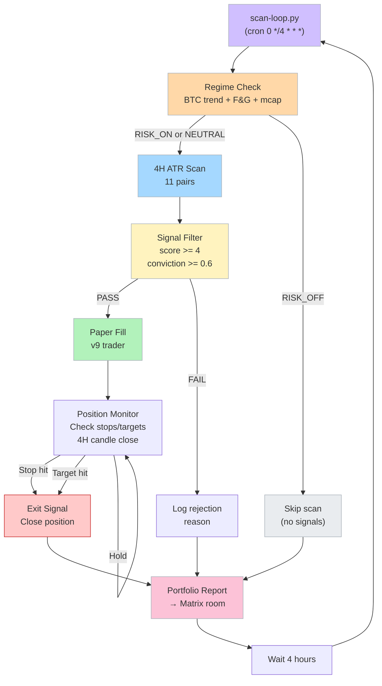

# Autonomous Scan Cycle

```mermaid
flowchart TD
    START["scan-loop.py\n(cron 0 */4 * * *)"]

    START --> REGIME["Regime Check\nBTC trend + F&G + mcap"]

    REGIME -->|"RISK_ON or NEUTRAL"| ATR4H["4H ATR Scan\n11 pairs"]
    REGIME -->|"RISK_OFF"| SKIP["Skip scan\n(no signals)"]

    ATR4H --> FILTER["Signal Filter\nscore >= 4\nconviction >= 0.6"]

    FILTER -->|"PASS"| FILL["Paper Fill\nv9 trader"]
    FILTER -->|"FAIL"| LOG["Log rejection\nreason"]

    FILL --> MON["Position Monitor\nCheck stops/targets\n4H candle close"]

    MON -->|"Stop hit"| EXIT["Exit Signal\nClose position"]
    MON -->|"Target hit"| EXIT
    MON -->|"Hold"| MON

    EXIT --> REPORT["Portfolio Report\n→ Matrix room"]

    LOG --> REPORT
    SKIP --> REPORT

    REPORT --> WAIT["Wait 4 hours"]
    WAIT --> START

    style START fill:#d0bfff,stroke:#adb5bd
    style REGIME fill:#ffd8a8,stroke:#adb5bd
    style ATR4H fill:#a5d8ff,stroke:#adb5bd
    style FILTER fill:#fff3bf,stroke:#adb5bd
    style FILL fill:#b2f2bb,stroke:#adb5bd
    style EXIT fill:#ffc9c9,stroke:#c92a2a
    style SKIP fill:#e9ecef,stroke:#adb5bd
    style REPORT fill:#fcc2d7,stroke:#adb5bd

```
