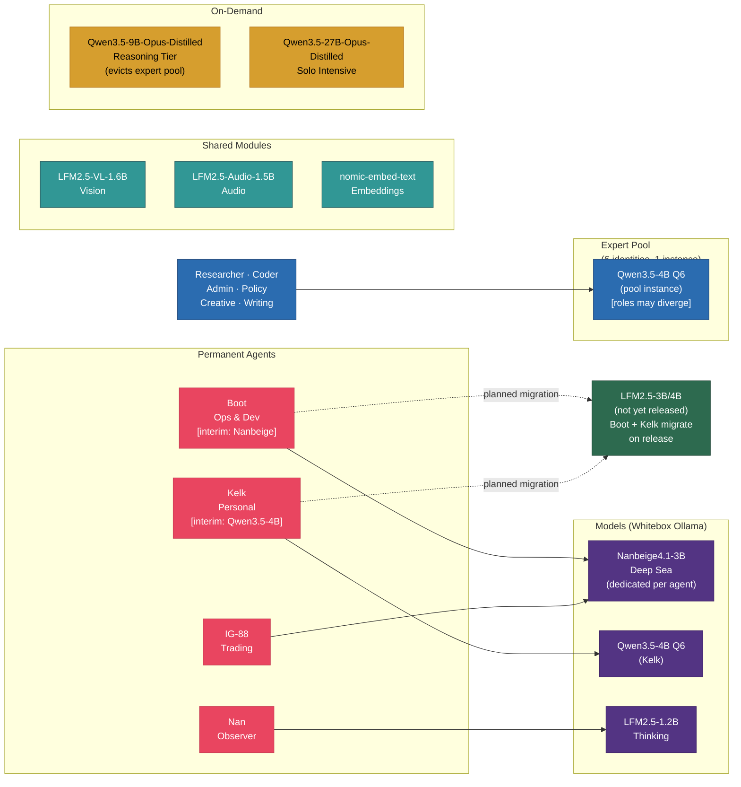

```mermaid
flowchart LR
    subgraph PERMANENT["Permanent Agents"]
        BOOT["Boot\nOps & Dev\n[interim: Nanbeige]"]
        IG88["IG-88\nTrading"]
        KELK["Kelk\nPersonal\n[interim: Qwen3.5-4B]"]
        NAN_AGENT["Nan\nObserver"]
    end

    subgraph MODELS["Models (Whitebox Ollama)"]
        NANBEI["Nanbeige4.1-3B\nDeep Sea\n(dedicated per agent)"]
        QWEN4B["Qwen3.5-4B Q6\n(Kelk)"]
        LFM12["LFM2.5-1.2B\nThinking"]
    end

    subgraph EXPERT["Expert Pool\n(6 identities, 1 instance)"]
        EXP["Qwen3.5-4B Q6\n(pool instance)\n[roles may diverge]"]
    end

    subgraph SHARED["Shared Modules"]
        VL["LFM2.5-VL-1.6B\nVision"]
        AUDIO["LFM2.5-Audio-1.5B\nAudio"]
        EMBED["nomic-embed-text\nEmbeddings"]
    end

    subgraph ONDEMAND["On-Demand"]
        Q9B["Qwen3.5-9B-Opus-Distilled\nReasoning Tier\n(evicts expert pool)"]
        Q27B["Qwen3.5-27B-Opus-Distilled\nSolo Intensive"]
    end

    LFM25_NOTE["LFM2.5-3B/4B\n(not yet released)\nBoot + Kelk migrate\non release"]

    BOOT --> NANBEI
    IG88 --> NANBEI
    KELK --> QWEN4B
    NAN_AGENT --> LFM12
    EXPERT_IDS["Researcher · Coder\nAdmin · Policy\nCreative · Writing"] --> EXP
    BOOT -.->|"planned migration"| LFM25_NOTE
    KELK -.->|"planned migration"| LFM25_NOTE

    classDef agent fill:#e94560,stroke:#c73e54,color:#fff
    classDef model fill:#533483,stroke:#422669,color:#fff
    classDef shared fill:#319795,stroke:#285e61,color:#fff
    classDef ondemand fill:#d69e2e,stroke:#b7791f,color:#000
    classDef expert fill:#2b6cb0,stroke:#2c5282,color:#fff
    classDef future fill:#2d6a4f,stroke:#1b4332,color:#fff

    class BOOT,IG88,KELK,NAN_AGENT agent
    class NANBEI,QWEN4B,LFM12 model
    class VL,AUDIO,EMBED shared
    class Q9B,Q27B ondemand
    class EXP,EXPERT_IDS expert
    class LFM25_NOTE future
```
