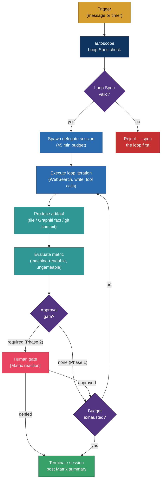

```mermaid
flowchart TD
  TRIGGER["Trigger\n(message or timer)"]
  AUTOSCOPE["autoscope\nLoop Spec check"]
  LOOPSPEC{"Loop Spec\nvalid?"}
  DELEGATE["Spawn delegate session\n(45 min budget)"]
  EXECUTE["Execute loop iteration\n(WebSearch, write, tool calls)"]
  ARTIFACT["Produce artifact\n(file / Graphiti fact / git commit)"]
  METRIC["Evaluate metric\n(machine-readable, ungameable)"]
  AGATE{"Approval\ngate?"}
  HUMAN["Human gate\n[Matrix reaction]"]
  BUDGETCHECK{"Budget\nexhausted?"}
  TERMINATE["Terminate session\npost Matrix summary"]
  REJECT["Reject — spec\nthe loop first"]

  TRIGGER --> AUTOSCOPE
  AUTOSCOPE --> LOOPSPEC
  LOOPSPEC -->|"yes"| DELEGATE
  LOOPSPEC -->|"no"| REJECT
  DELEGATE --> EXECUTE
  EXECUTE --> ARTIFACT
  ARTIFACT --> METRIC
  METRIC --> AGATE
  AGATE -->|"none (Phase 1)"| BUDGETCHECK
  AGATE -->|"required (Phase 2)"| HUMAN
  HUMAN -->|"approved"| BUDGETCHECK
  HUMAN -->|"denied"| TERMINATE
  BUDGETCHECK -->|"no"| EXECUTE
  BUDGETCHECK -->|"yes"| TERMINATE

  classDef trigger fill:#d69e2e,stroke:#b7791f,color:#000
  classDef check fill:#0f3460,stroke:#2a2a4a,color:#eaeaea
  classDef decision fill:#533483,stroke:#422669,color:#fff
  classDef exec fill:#2b6cb0,stroke:#2c5282,color:#fff
  classDef artifact fill:#319795,stroke:#285e61,color:#fff
  classDef gate fill:#e94560,stroke:#c73e54,color:#fff
  classDef terminal fill:#38a169,stroke:#276749,color:#fff
  classDef reject fill:#c53030,stroke:#9b2c2c,color:#fff

  class TRIGGER trigger
  class AUTOSCOPE check
  class LOOPSPEC,AGATE,BUDGETCHECK decision
  class DELEGATE,EXECUTE exec
  class ARTIFACT,METRIC artifact
  class HUMAN gate
  class TERMINATE terminal
  class REJECT reject
```
