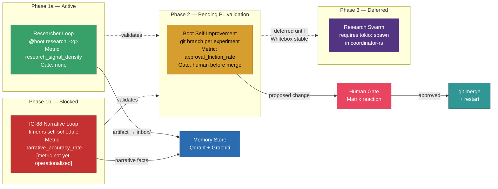

```mermaid
flowchart LR
  subgraph P1A ["Phase 1a — Active"]
    RESEARCHER["Researcher Loop\n@boot research: &lt;q&gt;\nMetric: research_signal_density\nGate: none"]
  end
  subgraph P1B ["Phase 1b — Blocked"]
    IG88_LOOP["IG-88 Narrative Loop\ntimer.rs self-schedule\nMetric: narrative_accuracy_rate\n[metric not yet operationalized]"]
  end
  subgraph P2 ["Phase 2 — Pending P1 validation"]
    BOOT_LOOP["Boot Self-Improvement\ngit branch per experiment\nMetric: approval_friction_rate\nGate: human before merge"]
  end
  subgraph P3 ["Phase 3 — Deferred"]
    SWARM["Research Swarm\nrequires tokio::spawn\nin coordinator-rs"]
  end

  P1A -.->|"validates"| P2
  P1B -.->|"validates"| P2
  P2 -.->|"deferred until\nWhitebox stable"| P3
  RESEARCHER -->|"artifact → inbox/"| MEM["Memory Store\nQdrant + Graphiti"]
  IG88_LOOP -->|"narrative facts"| MEM
  BOOT_LOOP -->|"proposed change"| HGATE["Human Gate\nMatrix reaction"]
  HGATE -->|"approved"| DEPLOY["git merge\n+ restart"]

  classDef active fill:#38a169,stroke:#276749,color:#fff
  classDef blocked fill:#c53030,stroke:#9b2c2c,color:#fff
  classDef pending fill:#d69e2e,stroke:#b7791f,color:#000
  classDef deferred fill:#533483,stroke:#422669,color:#fff
  classDef storage fill:#2b6cb0,stroke:#2c5282,color:#fff
  classDef gate fill:#e94560,stroke:#c73e54,color:#fff
  classDef deploy fill:#319795,stroke:#285e61,color:#fff

  class RESEARCHER active
  class IG88_LOOP blocked
  class BOOT_LOOP pending
  class SWARM deferred
  class MEM storage
  class HGATE gate
  class DEPLOY deploy
```
