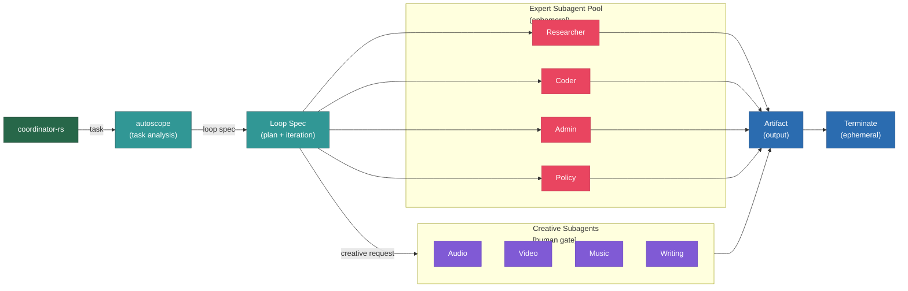

```mermaid
flowchart LR
    COORD["coordinator-rs"]
    AUTOSCOPE["autoscope\n(task analysis)"]
    LOOPSPEC["Loop Spec\n(plan + iteration)"]

    subgraph EXEC_POOL["Expert Subagent Pool\n(ephemeral)"]
        RESEARCHER["Researcher"]
        CODER["Coder"]
        ADMIN["Admin"]
        POLICY["Policy"]
    end

    subgraph CREATIVE["Creative Subagents\n[human gate]"]
        C_AUDIO["Audio"]
        C_VIDEO["Video"]
        C_MUSIC["Music"]
        C_WRITE["Writing"]
    end

    ARTIFACT["Artifact\n(output)"]
    TERMINATE["Terminate\n(ephemeral)"]

    COORD -->|"task"| AUTOSCOPE
    AUTOSCOPE -->|"loop spec"| LOOPSPEC
    LOOPSPEC --> RESEARCHER
    LOOPSPEC --> CODER
    LOOPSPEC --> ADMIN
    LOOPSPEC --> POLICY
    LOOPSPEC -->|"creative request"| CREATIVE
    RESEARCHER & CODER & ADMIN & POLICY --> ARTIFACT
    CREATIVE --> ARTIFACT
    ARTIFACT --> TERMINATE

    classDef coord fill:#276749,stroke:#1c4532,color:#fff
    classDef infra fill:#319795,stroke:#285e61,color:#fff
    classDef exec fill:#e94560,stroke:#c73e54,color:#fff
    classDef creative fill:#805ad5,stroke:#6b46c1,color:#fff
    classDef output fill:#2b6cb0,stroke:#2c5282,color:#fff

    class COORD coord
    class AUTOSCOPE,LOOPSPEC infra
    class RESEARCHER,CODER,ADMIN,POLICY exec
    class C_AUDIO,C_VIDEO,C_MUSIC,C_WRITE creative
    class ARTIFACT,TERMINATE output
```
