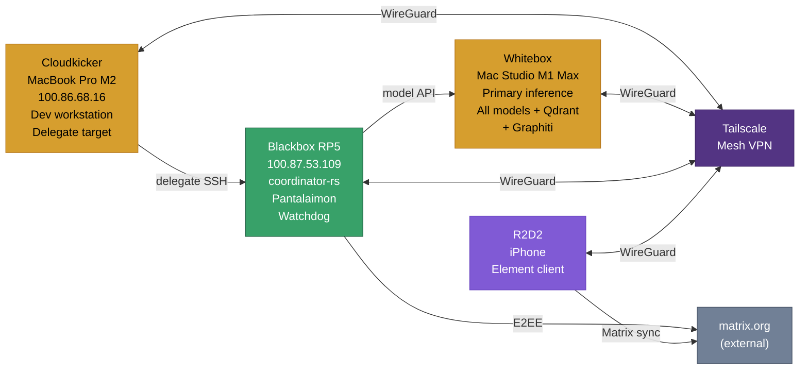

```mermaid
flowchart LR
    CK["Cloudkicker\nMacBook Pro M2\n100.86.68.16\nDev workstation\nDelegate target"]
    WB["Whitebox\nMac Studio M1 Max\nPrimary inference\nAll models + Qdrant\n+ Graphiti"]
    BB["Blackbox RP5\n100.87.53.109\ncoordinator-rs\nPantalaimon\nWatchdog"]
    R2["R2D2\niPhone\nElement client"]
    TS["Tailscale\nMesh VPN"]
    MATRIX["matrix.org\n(external)"]

    CK <-->|"WireGuard"| TS
    WB <-->|"WireGuard"| TS
    BB <-->|"WireGuard"| TS
    R2 <-->|"WireGuard"| TS
    BB -->|"E2EE"| MATRIX
    R2 -->|"Matrix sync"| MATRIX
    CK -->|"delegate SSH"| BB
    BB -->|"model API"| WB

    classDef mac fill:#d69e2e,stroke:#b7791f,color:#000
    classDef bb fill:#38a169,stroke:#276749,color:#fff
    classDef mobile fill:#805ad5,stroke:#6b46c1,color:#fff
    classDef net fill:#533483,stroke:#422669,color:#fff
    classDef ext fill:#718096,stroke:#4a5568,color:#fff

    class CK,WB mac
    class BB bb
    class R2 mobile
    class TS net
    class MATRIX ext
```
