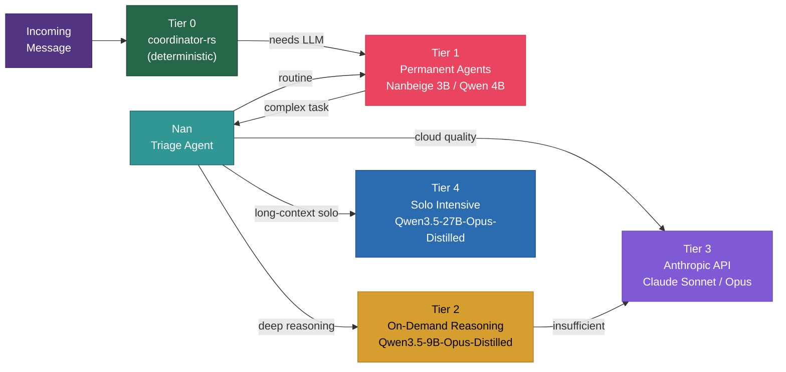

```mermaid
flowchart LR
    NAN_TRIAGE["Nan\nTriage Agent"]

    T0["Tier 0\ncoordinator-rs\n(deterministic)"]
    T1["Tier 1\nPermanent Agents\nNanbeige 3B / Qwen 4B"]
    T2["Tier 2\nOn-Demand Reasoning\nQwen3.5-9B-Opus-Distilled"]
    T3["Tier 3\nAnthropic API\nClaude Sonnet / Opus"]
    T4["Tier 4\nSolo Intensive\nQwen3.5-27B-Opus-Distilled"]

    MSG["Incoming\nMessage"] --> T0
    T0 -->|"needs LLM"| T1
    T1 -->|"complex task"| NAN_TRIAGE
    NAN_TRIAGE -->|"routine"| T1
    NAN_TRIAGE -->|"deep reasoning"| T2
    NAN_TRIAGE -->|"cloud quality"| T3
    NAN_TRIAGE -->|"long-context solo"| T4
    T2 -->|"insufficient"| T3

    classDef coord fill:#276749,stroke:#1c4532,color:#fff
    classDef tier1 fill:#e94560,stroke:#c73e54,color:#fff
    classDef tier2 fill:#d69e2e,stroke:#b7791f,color:#000
    classDef tier3 fill:#805ad5,stroke:#6b46c1,color:#fff
    classDef tier4 fill:#2b6cb0,stroke:#2c5282,color:#fff
    classDef triage fill:#319795,stroke:#285e61,color:#fff
    classDef input fill:#533483,stroke:#422669,color:#fff

    class T0 coord
    class T1 tier1
    class T2 tier2
    class T3 tier3
    class T4 tier4
    class NAN_TRIAGE triage
    class MSG input
```
